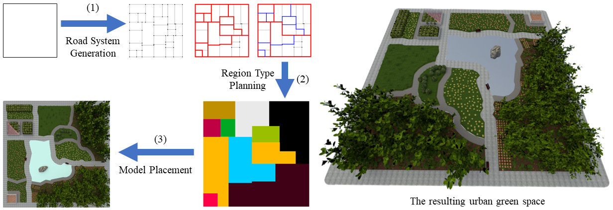

# \[!!!IMPORTANT!!!\]
We understand that our platform needs a lot of dependencies and data since the platform integrates much research work of us. Therefore, we have prepared a COPY of our platform for anyone with research-only needs. The COPY contains ALL necessary code and data. You simply download the COPY, install the python requirements (typically the flask server) and "python main.py". 

To download the COPY, please email us at \[shaokui@tsinghua.edu.cn\]. In the email, please briefly tell us your purpose (We hope we haven't offended you), e.g., requiring baselines, etc. Please also confirm that your purpose is non-commercial, i.e., research-only. Then, we will send you an FTP link, including the username and password. We kindly ask that you not distribute the link. The link can only be used for the ones received from us and their lab colleagues. 

We are preparing a quick tutorial (to appear). If you have any questions, please also email us. Our group is very small. We will answer you as soon as possible. 
# Introduction
Platform Overview             |  Viewing & Roaming
:-------------------------:|:-------------------------:
  |  

Manipulating             |  Synthesis
:-------------------------:|:-------------------------:
  |  

This is the repository of the paper "**Geometry-Based Layout Generation with Hyper-Relations AMONG Objects**", "**MageAdd: Real-Time Interaction Simulation for Scene Synthesis**", "**SceneViewer: Automating Residential Photography in Virtual Environments**" and "**SceneDirector: Interactive Scene Synthesis by Simultaneously Editing Multiple Objects in Real-Time**". Our platform is web-based. We hope this repository can help research on 3D scenes and reproducing our framework. Because our group is small, this repo may potentially contain engineering bugs and this doc may not cover all confusion. Please issue us if you have problems with this repo or e-mail us at shaokui@tsinghua.edu.cn. 

We assume developers and researchers would first deploy this platform. The [manuals](#Manuals) are available in the latter of this doc if you wish to use a ready clone directly. 

This platform is **NOT** aiming at photo-realistic illumination, though we are continuously improving the rendering. Instead, we provide an interactive environment for visualizing and debugging algorithms or frameworks related to 3D scenes. 

# Requirements
Requirements are mainly for running the back end, including the algorithm. Dependencies at the front-end are already included, but Chrome is still recommended. 

It is suggested to use conda to manage the environment. The following command will create a new environment with the required packages (you can also install the required packages manually using pip):

```cmd
conda env create -n [Name] -f environment.yml
```

Note that the CUDA version of `torch` is needed. So be sure to install the compatible version of `torch`.

After installing the requirements, run the server using:

```
python main.py
```

This platform cooperates with other organizations, so other packages may be required, e.g., ```baidu_aip```, ```librosa```, etc. Such features are not mandatory. Thus, you can simply `comment` on unnecessary packages. Note that some packages are mandatory for running the server, especially the algorithm, such as ```torch```, ```flask```, etc. We recommend installing the entire 'requirements.txt' on the safe side. To install packages, you need not strictly match the versions above. We attached those versions simply because they work for our deployment. Please issue us if you have trouble deploying. 

# Datasets
This section discusses how we organize datasets. This platform follows **S**hao**K**ui-Format, the Scalable and Kross-Platform Format. Note that we have no copyright to distribute datasets, especially SUNCG. 3D-Front is available. Please refer to their [website][3dfront] for downloading. Our platform has its own organization of datasets, so the downloaded datasets should be reorganized to 'root/dataset'. A [script][3dfront2suncg] exists for converting 3D-Front to SK-Format. The below paragraphs also illustrate our format in detail. 

Please refer to the following link for the dataset with the exact version we are using. 
```
https://pan.baidu.com/s/1HqHcCOnHKK0VdNhiHmMDoA?pwd=fvya 
Extraction Code: fvya 
```

## Models
Since models are reusable in multiple scenes. The repository of models is separated from the repo of scenes. Please organize models in the ```object``` folder of the ```dataset``` folder:  
<pre>
root
|  main.py
|  otherpythonfiles.py
|  ...
|  dataset
|    room
|    <b>object</b>
|    |  objname1
|    |    <b>objname1.obj</b>
|    |    <b>objname1.mtl</b>
|    |    rendered_images
|    |  objname2
|    |  objname3
|    |  ...
|    texture
|  latentspace
|  static
|  ...
</pre>
Each obj-folder in ```object``` belongs to a single 3D model, e.g., a chair or a table. Each obj-folder in ```object``` has a **unique** name or id that exclusively refers to this model, e.g., `objectname1`. Currently, our platform supports only `wavefront .obj files`, so each obj-folder includes at least a .obj file and a .mtl file, e.g., 'modelname1.obj' and 'modelname1.mtl' in 'modelname1'.  

Note that textures are also reusable by another ```texture``` folder in ```dataset```. Links of textures are URL with respect to the server, e.g.,  
```
../texture/wood_1.jpg
```
In 3D-Front, we have found only geometries and textures of 3D objects, i.e., '.obj' and '.png'. Mateirals, i.e., '.mtl' files, are automatically generated by our scripts. 

## Priors
Priors are organized in 'root/latentspace/pos-orient-3/'. In this directory, each .json file with a single object name contains pairwise priors for this object as a dominant object. For example, a .json file named '1435.json' contains priors for the dominant object named 1435, where several attributes exist, such as '2497' and '2356', which are secondary objects related to the dominant objects. Thus, two names of a dominant object and a secondary object index are used to create a list of priors. Our priors are discrete, as discussed in our paper. An item in a prior list (set) between two objects has four values: X, Y, Z, and theta. The former three values are transitions, and the fourth one is the rotation of the Y-axis. Though our platform supports different rotating orders in engineering, our layout framework ONLY supports the 'XYZ' rotation. 

In the same directory, each .json file with two object names is a prior set of a pattern chain. Each pattern chain file is a list of another list. The 'outer' list has several chains, and the 'inner' list includes indices to the source pairwise relations. Hyper-Priors are organized in 'root/latentspace/pos-orient-3/hyper'. Similarly, the 'outer' list has several hyper-priors, but the 'inner' one is a dict object indexing to different source pairwise relations. Note that hyper-relations are generated online when our framework requires. 

The pre-learnt priors can be downloaded in [Tsinghua-Cloud][thucpriorlink] or [Google-Drive][googlepriorlink]. 

## Layout Configuration
A 'layout-config' file is a JSON that includes essential attributes of a scene. The structure of a config file is presented below: 
```
origin
bbox:{
  min
  max
}
up
front
rooms:[
  room1:{
  |  modelId
  |  roomTypes:[...]
  |  bbox:{
  |    min
  |    max
  |  }
  |  roomId
  |  objList:[
  |    object1:{
  |    |  type
  |    |  modelId
  |    |  bbox
  |    |  translate
  |    |  scale
  |    |  rotate
  |    |  rotateOrder
  |    |  orient
  |    |  coarseSemantic
  |    |  roomId
  |    |  inDatabase
  |    },
  |    object2:{...},
  |    object3:{...},
  |    ...
  |  ]
  },
  room2:{...},
  room3:{...},
  ...
]
```
In sum, each config contains a list of rooms, and a room contains a list of objects. Each config file has an ```origin``` denoting where it derives from since our platform has its supporting data structure. For instance, in 3D-Front, it could be ```ffca6fce-0adb-48e4-be68-17343d6efffd```. A ```bbox``` denotes AABB bounding box of an entire layout, a room or an object. Although ```bbox``` is optional, it is still useful if users wish to [automatic calibrate the camera][#manuals]. ```up``` and ```front``` are used by the perspective camera denoting 'up vector' and 'camera direction', which is typically '[0,1,0]' and '[0,0,1]'.  

Each room optionally has a ```roomTypes```, e.g., '['living room', 'kitchen']'. A 'modelId' of a room indexes to its ceiling, floor and wall. In this platform, similar to SUNCG, we split a room mesh into a ceiling, a floor and a wall. For example, a room with ```modelId: KidsRoom-1704``` has a 'KidsRoom-1704c.obj', 'KidsRoom-1704f.obj' and a 'KidsRoom-1704w.obj' in the 'root/dataset/room/{```origin```}/' directory. This simply separate room meshes with objects and separates floors, ceilings and walls, which is an engineering and design decision for research on scene synthesis or layout generation. If this separation is unnecessary in your research, you can ignore this attribute and take all meshes as 'objects' in ```objList```. ```roomId``` is necessary in our platform. It is the index of this room in the ```rooms``` list of a config file. This attribute is used for fast indexing rooms and objects. Similarly, each object has a ```roomId``` denoting its room. 

Each object must have a ```modelId``` indexing its mesh in the directory 'root/dataset/object/{```modelId```}'. ```translate```, ```scale``` and ```rotate``` are also mandatory. They are all lists with 3 elements, e.g., ```"rotate": [0.0,-0.593,0.0],```. ```type``` is optional. We use this attribute to separate ordinary objects, windows, doors, etc `rotateOrder``` is typical 'XYZ' in our platform, but we allow custom rotating orders. ```coarseSemantic``` is optional if you would label objects, e.g., 'armchair'. 

# Layout Framework


[\[Paper\]][graphicalmodels] [\[Pre\]][gbaPre] [\[Supp\]][graphicalmodels]

Our layout framework in the paper "Geometry-Based Layout Generation with Hyper-Relations AMONG Objects" is included in the following files: 
```
root/
--autolayoutv2.py
--patternChainv2.py
--projection2d.py
--layoutmethods/
----alutil.py
----relayout.py
```
**autolayoutv2.py**: coherent grouping, prior loading, prior caching and bounding box generating, etc.;  
**patternChainv2.py**: the code to dynamically check and generate hyper-relations;  
**alutil.py** and **relayout.py**: geometric arranging;  
**projection2d.py**: converting room meshes to polygons (room shape); 

If all dependencies are satisfied, our layout method can be run by clicking the **layout1** button in the front-end GUI. Note that you have to select a room first. The 'autolayout.py' and 'patternChain.py' are also usable, but only for the SUNCG dataset. The 'v2' version of our method is specifically for 3D-Front. 

Our layout framework is accepted as an oral presentation in [Computational Visual Media 2021][cvm2021], and is published in [Graphical Models][gmod]. Please cite our paper if this repository helps! 
```
@article{ZHANG2021101104,
title = {Geometry-Based Layout Generation with Hyper-Relations AMONG Objects},
journal = {Graphical Models},
volume = {116},
pages = {101104},
year = {2021},
issn = {1524-0703},
doi = {https://doi.org/10.1016/j.gmod.2021.101104},
url = {https://www.sciencedirect.com/science/article/pii/S1524070321000096},
author = {Shao-Kui Zhang and Wei-Yu Xie and Song-Hai Zhang}
}
```
# MageAdd


[\[Paper\]][mageaddPaper] [\[Video\]][mageaddVideo] [\[Supp\]][mageaddSupp]

This project is also the container for MageAdd, an interactive modelling tool for 3D scene synthesis. The source code of the MageAdd is included in the following files:
```
root/
--main_magic.py
--static/
----js/
------MageAdd.js
```
The .py file corresponds to the **Piror Update**, and the .js file contains the main logic of MageAdd inference. The front-end dependencies are already included in the index.html. Please first install the back-end dependencies in the back-end (main_magic.py). 

Our paper has been accepted as an oral presentation in [ACM MM 2021][acmmm2021]. Please cite our paper if this repository helps! 
```
@inproceedings{shaokui2021mageadd,
  title={MageAdd: Real-Time Interaction Simulation for Scene Synthesis},
  author={Zhang, Shao-Kui and Li, Yi-Xiao and He, Yu and Yang Yong-Liang and Zhang Song-Hai},
  booktitle={Proceedings of the 29th ACM International Conference on Multimedia, October 20--24, 2021, Virtual Event, China},
  year={2021},
  doi={10.1145/3474085.3475194}
}
```
# SceneViewer


[\[Paper\]][sceneviewerpaper] [\[Video\]][sceneviewer] [\[Supp\]][sceneviewersupp]

This project is also the container for our work on automatic Photography in 3D residential scenes. The related source code includes:
```
root/
--autoview.py
--sceneviewer/
----constraints.py
----inset.py
----utils.py
----views.py
```
The "autoview.py" contains the fundamental logic of our method, which will call functions for deriving probe views and use constraints for evaluating views. It also organizes and renders the generated views. One could consider it as a controller. The "views.py" contains how we generate probe views based on one-point and two-point perspectives. The "constraints.py" contains the measurements, i.e., the content and aesthetic constraints. The "utiles.py" contains several functions for geometrical computing. Finally, "inset.py" contains the "mapping" algorithm proposed in the paper. 
# SceneDirector


[\[Paper\]][scenedirectorpaper] [\[Video\]][scenedirector] [\[Supp\]][scenedirectorsupp] [\[Dataset\]][scenedirectordataset]

This project is also the container for our interactive scene synthesis framework, which simulteanously edits multiple objects in each interactive session. The related source code includes:
```
root/
--sk.py
--static/
----js/
------MageAdd.js
```
The "cgs" function in sk.py is the entrance for preprocessing each coherent group set. The functions named using "CGS" in "MageAdd.js" are the functions for synthesizing scenes online (e.g., when a user controls the mouse). 
# CommercialScene


[\[Paper\]][traffic] [\[Video\]][trafficflow] [\[Supp\]][trafficsupp] 

This project includes our algorithm for generating commercial scenes. The related source code is all in the following directory:
```
root/
--layoutmethods/
----trafficflow/
```
Note that the code generates scene jsons which should be loaded in this platform for visualization. 

# ScenePhotographer


[\[Paper\]](https://cg.cs.tsinghua.edu.cn/Shao-Kui/Papers/ScenePhotographer.pdf) [\[Video\]][photographervideo]

This project is also the container of ScenePhotographer, an object-oriented framework for automatic view selection in residential scenes. The related source code is in the following files:
```
root/
--new_autoview.py
--scenePhotographer/
----constraints.py
```

The code in new_autoview.py is related to object clustering and proposal of candidate views, and the code in constraints.py contains four citeria of view evaluation. 

# SceneExpander


[\[Paper\]](https://cg.cs.tsinghua.edu.cn/Shao-Kui/Papers/SceneExpander.pdf) [\[Video\]][expandervideo]

This project is also the container of SceneExpander, an interactive scene synthesis framework which allows user to generate layouts by expanding its outer edge. The related source code is in the following files:
```
root/
--static/
----js/
------movelinemodel.js
------yl.js
```
The code in movelinemodel.js corresponds to the floor plan generation and evaluation step in the framework's pipeline, and the code in yl.js performs the operations related to the elastic boxes. These code are used by the frontend logic written in root/static/js/sk.js.

# StoreSketcher


[\[Paper\]][store] [\[Video\]][storevideo]

This project includes our algorithm for interactively synthesizing commercial scenes. The related source code is all in the following directory:
```
root/
--layoutmethods/
----shelfarrangement/
```

# SceneExplorer


[\[Paper\]][SceneExplorerPaper] [\[Supp\]][SceneExplorerSupp] [\[Video\]][SceneExplorerVideo] [\[Dataset\]][SceneExplorerDataset]

Note that the dataset/results should be put in **static\dataset\object** and **static\dataset\infiniteLayout** folders. The configuration is a bit complex. If you only need to run SceneExplorer, i.e., demos. Please see the **Important Notification** above. We can send you a full copy of our system, including the configured dataset/results in the correct paths. 

The code for generating transformable layouts and utilizing them is in different folders. Generating transformable layouts can be found at: 
```
root/
--layoutmethods/
----sceneexplorer/
```

The code for utilizing the transformable layout is part of this platform. To support transformable modules, we made a lot of changes on the platform, including but not limited to supporting transformable module loading and caching (**static\js\load.js**), manipulating transformable modules (**static\js\sk.js**), recoding transformable layouts timelines (**static\js\animation_record.js**). We tried our best to make them as modular as possible, but we still need to modify different platform parts. Our group is small. If you really need to modify or change how this platform manipulates transformable layouts and modules, please email us at shaokui@tsinghua.edu.cn. 

The code for visualizing transformable layouts, i.e., the hierarchy proposed in the paper, can be found at: 
```
root/
--static/
----infiniteLayout/
------chart1.js
------chart2.js
------d3.js
------d3Zoom.js
------treeWindow.js
```
In general, this visualisation panel is implemented by D3.js. 

# Urban Green Space Planning



[\[Paper\]][GreenSpace] [\[Video\]][GreenSpaceVideo]

This project includes our algorithm for automatically planning urban green spaces. The source code for generation is in:

```
root/
--layoutmethods/
----greenspace/
```

First, move into this directory `cd layoutmethods/greenspace`. 

Then run `python main.py` to start the generation. The results are stored in `outputs/`. Json files in this directory can be directly loaded into the online platform for visualization. 

# Manuals  

Our platform is split into two panels: operation & 3D scene. The operation panel allows rendering, layouting, saving, and loading scenes. We also allow searching objects by semantics and names(id). One could add more objects by left-clicking a searched result and left-clicking a position in a scene. The 3D scene panel uses an orbital controller, where interactions follow:  
**Axis**: The `Axis` button display/hide the world axis (Red: X, Blue: Z, Green, Y);   
**MouseClick-Left**: Left-click has multiple behaviours on this platform. If clicking an object in the scene, a 'revolver' is shown waiting for further operations, such as transition(XoZ), transition(Y), rotation, deletion, etc. After clicking a button such as 'transition(XoZ)', the selected object moves following the mouse cursor. With another left-click, the object is fixed at the user-wanted position, and this routine is finished. If clicking a room, the platform with take the room as the current operational room, e.g., layout.  
**ScenePanel**: The scene panel on the left shows meta-data of current scenes, rooms and objects, e.g., room types and object categories.  
**MouseClick-LeftHold**: Left-click and rotate the perspective camera for various views. The rotation (eulerangles) supports 'pitch' and 'yaw'.  
**MouseClick-RightHold**: Right-click and hold in the scene results in transiting the perspective camera.  
**Space**: Automatically align the camera with respect to the selected room, and adjust the camera's height.  
**Mouse Wheel**: Zoom In & Zoom Out.  
**↑**: Camera moving up;  
**↓**: Camera moving down;  
**←**: Camera moving left;  
**→**: Camera moving right;  
**Q**: Anti-clockwisely rotating 'yaw' of the perspective camera;  
**E**: Clockwisely rotating 'yaw' of the perspective camera;  
**C**: Disable/Enable the orbital controller. This is very useful if you wish to freeze your view, transform several objects and render instead of mistakenly tuning views; 
**R**: Shortcut for Rendering;   

# Future works
We will improve the rendering in the future. We have tried libraries of [Three.js][threejsweb] and several related 3rd-party repositories. Nevertheless, better effects are still not generated. We will continue investigating this to figure out whether we have engineering problems or need to resort to global rendering in the back end. We will be highly grateful if you have better ideas for improving rendering! We will also swap to a production WSGI server at the back end. 

This repo will continuously update with more functions, features and open-source research. We welcome more collaborators, especially if you want to merge your algorithms or functionalities. 

## Known Problems or Bugs

* The `click` event of the scene canvas may be defunct for unknown reasons. 
* The navigation of the mini-map (Bottom-Left) is currently defunct. 

# Acknowledgement
This platform is designed, structured and implemented by [Shao-Kui Zhang][shaokui](shaokui@tsinghua.edu.cn), [Song-Hai Zhang][songhai] and Yuan Liang. Wei-Yu Xie is involved in voice-based model retrieval, room mesh processing and object recommendation using latent space (TBD). Yike Li and Yu-Fei Yang are involved with the Unity-based client for VR. Tian-Xing Xu is involved in the format conversion of 3D-Front. Xiang-Li Li is involved in sketch searching, refining datasets and dataset converting. 

Shao-Kui Zhang, Wei-Yu Xie and Song-Hai Zhang designed and implemented our layout framework. We also appreciate Kai Wang for the experiment. 

The MageAdd is designed and implemented by Shao-Kui Zhang, Yi-Xiao Li, Yu He, [Yong-Liang Yang][yongliang], and Song-Hai Zhang. 

The SceneViewer is designed and implemented by Shao-Kui Zhang, Hou Tam, Yi-Xiao Li, [Tai-Jiang Mu][taijiangpage], and Song-Hai Zhang. 

The SceneDirector is designed and implemented by Shao-Kui Zhang, Hou Tam, Yike Li, Ke-Xin Ren, [Hongbo Fu][hongbopage], and Song-Hai Zhang. 

The SceneExplorer is designed and implemented by Shao-Kui Zhang, Jia-Hong Liu, Junkai Huang, Zi-Wei Chi, Hou Tam, Yong-Liang Yang and Song-Hai Zhang. We also thank the reviewers for helping us improve this paper. As you can see from the source code, implementing the platform and algorithm of SceneExplorer has consumed more than two years. We started from nothing. The dataset, engineering parts, algorithm and visualization are ALL built by our small team. We would like to share all we built to alleviate future work. 

# Copyright
This platform is developed for research, though our license follows [GNU GPL 3.0][GNUGPL3]. The back-end is NOT guaranteed security if you have sensitive or private data, which is significant if you wish to deploy this platform publicly. 

[3dfront]:https://pages.tmall.com/wow/cab/tianchi/promotion/alibaba-3d-scene-dataset
[threejsweb]:https://threejs.org/
[shaokui]:https://shao-kui.github.io/
[songhai]:https://www.cs.tsinghua.edu.cn/info/1117/3538.htm
[GNUGPL3]:http://www.gnu.org/licenses/gpl-3.0.html
[cvm2021]:http://iccvm.org/2021/
[gmod]:https://www.journals.elsevier.com/graphical-models
[thucpriorlink]:https://cloud.tsinghua.edu.cn/f/36a3e973fe014bd89fcf/
[googlepriorlink]:https://drive.google.com/drive/folders/15WBBqGS79C9nG8m_41Bn43rzv3Cxb4xH?usp=sharing
[3dfront2suncg]:https://github.com/Shao-Kui/3DScenePlatform/blob/master/assets/3dfuture2suncg.py
[graphicalmodels]:https://cg.cs.tsinghua.edu.cn/course/vis/Shao-Kui/GBA.pdf
[mageaddPaper]:https://cg.cs.tsinghua.edu.cn/course/vis/Shao-Kui/MageAdd.pdf
[mageaddVideo]:https://www.bilibili.com/video/BV1JP4y1x78p/
[mageaddSupp]:https://cg.cs.tsinghua.edu.cn/course/vis/Shao-Kui/DocMageAdd.pdf
[gbaPre]:https://www.bilibili.com/video/BV1FU4y1a7A1/
[acmmm2021]:https://2021.acmmm.org/
[yongliang]:http://yongliangyang.net/
[sceneviewerpaper]:https://cg.cs.tsinghua.edu.cn/course/vis/Shao-Kui/SceneViewer.pdf
[sceneviewer]:https://www.bilibili.com/video/BV1Q84y1B7tb
[sceneviewersupp]:https://ieeexplore.ieee.org/document/9920233/media#media
[scenedirectorpaper]:https://cg.cs.tsinghua.edu.cn/course/vis/Shao-Kui/SceneDirector.pdf
[scenedirector]:https://www.bilibili.com/video/BV11L411e72M
[scenedirectorsupp]:https://ieeexplore.ieee.org/document/10106472/media#media
[scenedirectordataset]:https://cloud.tsinghua.edu.cn/f/dd74c0617cb144198f0e/
[trafficflow]:https://www.bilibili.com/video/BV1gV4y1i7VN
[hongbopage]:https://www.scm.cityu.edu.hk/people/fu-hongbo
[taijiangpage]:https://cg.cs.tsinghua.edu.cn/people/~mtj/
[traffic]:https://cg.cs.tsinghua.edu.cn/course/vis/Shao-Kui/cmmercialscene.pdf
[trafficsupp]:https://dl.acm.org/doi/abs/10.1145/3581783.3613456
[storevideo]:https://www.bilibili.com/video/BV1ii421Y7Gs
[SceneExplorerPaper]:https://ieeexplore.ieee.org/document/10739397
[SceneExplorerSupp]:https://ieeexplore.ieee.org/document/10739397
[SceneExplorerVideo]:https://www.bilibili.com/video/BV16BSkYDEWj
[SceneExplorerDataset]:https://cloud.tsinghua.edu.cn/f/f8698488edd240e4885a/?dl=1
[expandervideo]:https://www.bilibili.com/video/BV1Zi421h7H5
[photographervideo]:https://www.bilibili.com/video/BV1kr421M7dy
