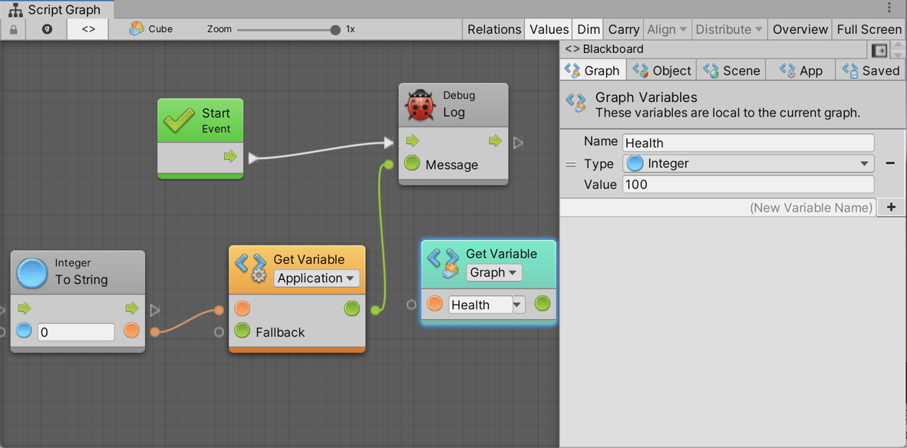

#Adding Variables

| **Note**                                                     |
| :----------------------------------------------------------- |
| For versions 2019/2020 LTS, download the visual scripting solution from the [Unity Asset Store](https://assetstore.unity.com/packages/tools/visual-bolt-163802). |

Variables are containers. Each variable has a name, a type, and a value. The value inside a variable can change during runtime.

###The Blackboard window

The blackboard window is opened via the blackboard (**<>**) button in the Script Graph window. It contains one tab per kind of variable. The graph tab is only enabled if a script graph is selected. The object tab is only enabled if a game object is selected.

To add a variable:

1.  Choose the tab corresponding to the type of variable you want to add.
2.  Type the name of the new variable in the New Variable Name field.
3.  Click the **Add (+)** button.
4.  Choose a type.
5.  (Optional) Change the default value.

