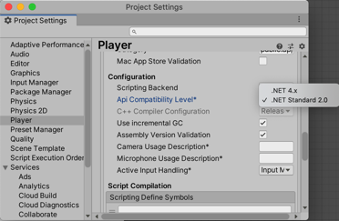

#Building for Mobile / Consoles

| **Note**                                                     |
| :----------------------------------------------------------- |
| For versions 2019/2020 LTS, download the visual scripting solution from the [Unity Asset Store](https://assetstore.unity.com/packages/tools/visual-bolt-163802). |

Visual scripting supports all Unity build targets, including **ahead-of-time (AOT)** platforms like iOS, Android, WebGL, WSA and consoles.

As of version 1.5.1, AOT Pre-build is an automatic pre-build step for all AOT platforms.

###Universal Windows Platform

When building for Universal Windows Platform (UWP, formerly known as Windows Store Apps, WSA, or Metro), visual scripting requires the use of the **IL2CPP** scripting backend. 

To change the platform, go to **Edit** > **Project Settings** &gt; **Player**, choose the **Other Settings** panel, **Configuration** sub-section. and select the correct value in the dropdown.

