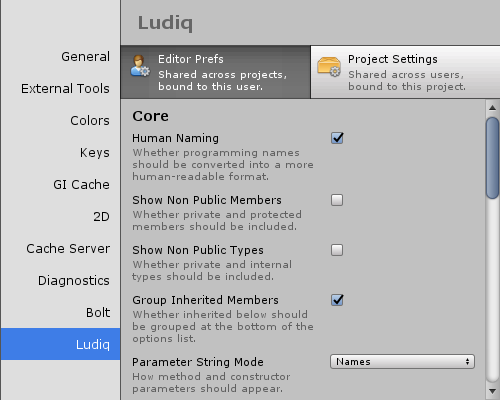

#Configuration

|**Note** |
|:---|
|For versions 2019/2020 LTS, download the visual scripting solution from the [Unity Asset Store](https://assetstore.unity.com/packages/tools/visual-bolt-163802).|

Bolt has many configuration options available.

They are split in two categories:

 * Ludiq for general settings from the Ludiq Framework, including graph settings.
 * Bolt for settings specifically related to script and state graphs.

You can access them from the Unity preferences window via Edit &gt; Preferences, then choosing either panel in the left sidebar, at the bottom.

 * Editor Prefs are usually editor interface options. They are saved per-computer and will not be shared with your team over version control. All projects with Bolt share the same editor prefs.
 * Project Settings are, on the contrary, shared with your team over version control. However, they belong to each project and won't be shared if you use Bolt in another project.

You can also open these panels directly from Project Settings > [Visual Script and Preferences] > [Bolt and Bolt Ex]

Each option has a tooltip explaining what it does, so feel free to explore and configure Bolt to your liking. If you're not sure what an option does, you can safely leave it to its default value for now.

Note: Some options require a restart. Currently, this isn't clearly indicated. If you find that your configuration change hasn't been applied, try restarting the editor.
