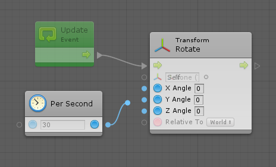
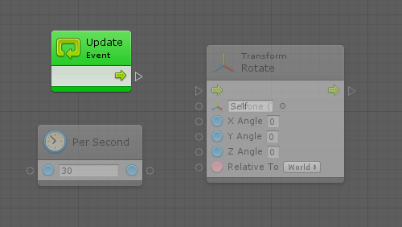
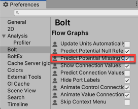
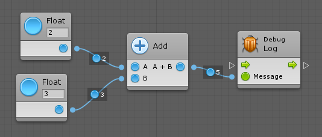
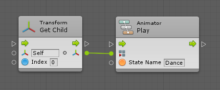
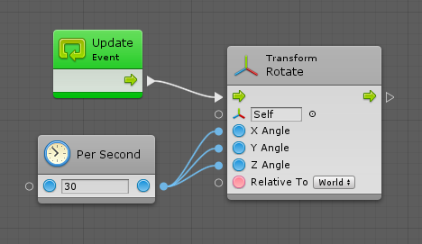
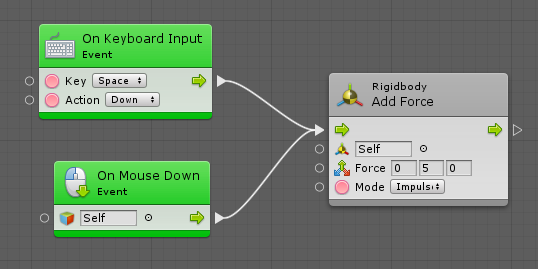
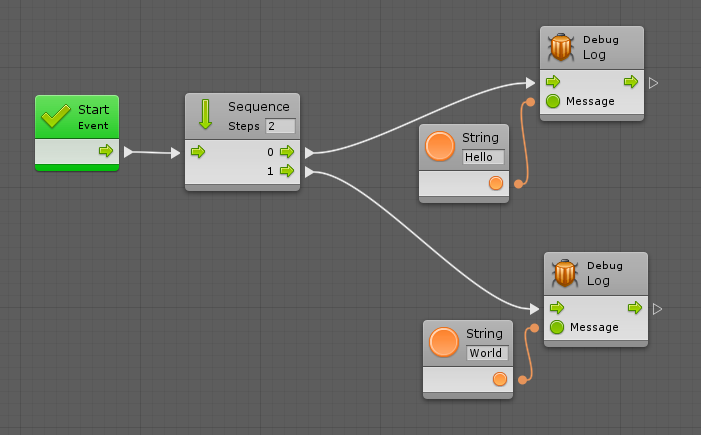

#Connecting units

| **Note**                                                     |
| :----------------------------------------------------------- |
| For versions 2019/2020 LTS, download the visual scripting solution from the [Unity Asset Store](https://assetstore.unity.com/packages/tools/visual-bolt-163802). |

Connections link between units and ports to create scripts. 

###Compatible ports

Compatible ports are highlighted when making a connection. Other (non-compatible) ports are dimmed out. If a unit does not have a compatible port, the entire unit is dimmed out. You cannot create a connection if the target port is not highlighted.

For example,  you cannot connect the result of the math operation (a number) to the target (a transform component) as there is no way to convert between a number and a transform component.

###Automatic Port Selection

Visual scripting helps you aim more easily by automatically selecting the best compatible port on a unit, even if your cursor is not directly over it. This port is highlighted with a yellow rectangle to let you preview where the connection would be made. This means you can quickly drag the new connection directly on the unit without aiming directly on the little port handle.

###Color Coding

Control connections are always white, whereas value connections are color-coded based on their type. You can find the color of each type in [Types](http://support.ludiq.io/topics/132-types/). Any type that doesn't have a color pellet icon has a green connection.

###Values

When the Values toggle is enabled in the toolbar, visual scripting shows the last value that traversed this connection during runtime.

When **Unity** >  **Preferences** > **Visual Scripting** > **Flow Graphs** > **Predict Potential Missing Connections** is enabled, visual scripting tries to predict the values before you enter play mode.

For example:

###Automatic Conversion

Visual scripting automatically converts many types to keep your graphs tidy.

For example, you don't need to use Get Component between the Transform output and the Animator input, because visual scripting does it automatically.

The following conversions are supported:

* Number to Number (e.g. integer to float and vice versa)
* Base Class to Child Class
* Child Class to Base Class
* Custom Operators (e.g. from Vector 2 to Vector 3)
* Game Object to Child Component
* Component to Parent Game Object
* Component to Sibling Component
* Enumerable to Array
* Enumerable to List

Visual scripting also supports boxing and unboxing; it allows you to connect from any object type port to any other value port. Note: it is your responsibility to ensure that the types are compatible, otherwise you get an error in play mode.

###Multiple Connections

A single port can be connected multiple times for convenience.

For example, you can connect a single value output port to multiple value input ports.

You cannot connect multiple value output ports to a single value input port as it wouldn't be clear which value should be used.

You can also connect multiple control output ports to a single control input port. For example, a jump force would be applied either when the player presses space or clicks on the object.

You cannot directly connect a single control output port to multiple control input ports as the order in which the exit units would be executed wouldn't be clear. You can use the special Sequence node under Control for this purpose.

If you want to chain more than two consecutive actions, just use a higher number in the field in the sequence node header.

###Contextual Options

Rather than first creating units then connecting them, you can start a connection, click on an empty space in the graph, and the fuzzy finder displays new unit options that are compatible with the selected source port. When you choose the new unit, visual scripting automatically connects it to the matching port.

