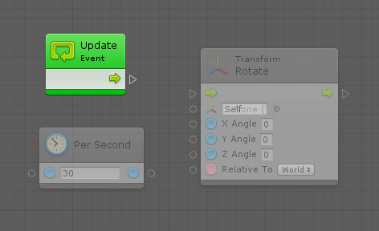

#Creating a connection

Connections are the links that attach units together to form logic flows.

To create a connection:

1. Do one of the following:

   * Click on the first **port** and drag and drop the link on a compatible unit. 
    Compatible units in the graph brighten, incompatible units dim.
   * Click on the first port and release.
     The fuzzy finder appears. Enter the name of the required unit or drill through the list to locate the unit. Either way, the new unit appears in the graph, linked to the source unit.

The units become fully visible as soon as they are in use.

To delete a connection, right-click on any of the connected ports.

Example: This graph reads as "at every frame, rotate your own transform in the Y axis at a rate of 30 degrees per second". 

There are two types of connections:

 * A Control Connection between the Update event and the Rotate invocation.
 * A Value Connection between the result of the Per Second node and the Y Angle of the Rotate node.

