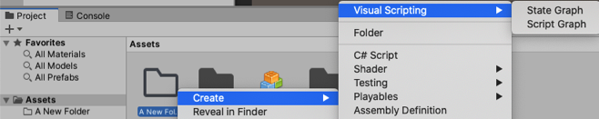

#Creating a graph

Graphs are re-usable and can be referenced by machines that have their Source set to graph. A graph is generally superior to an embed - it is reusable, not tied to the object, and works safely with prefabs.

To create a graph:

1. Right-click in an empty folder in your Project panel. 

2. Select **Create** > **Visual Scripting** &gt; **(Script** or **State) Graph**. 
   Note: Although it is recommend to place your graphs in a top-level Graphs folder, folder organization has no impact on functionality.
   
   
   
3. Drag-and-drop your new graph to the machine (from the Assets folder you created) to machine's Graph field (which currently states None (Script Graph Asset)).

The graph is assigned to the machine.

