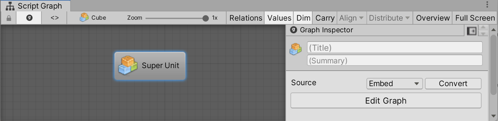

#Creating A Super Unit

Super Units are script graphs that are nested in a parent script graph as a single unit. 

To create a blank super unit:

1. Right-click an empty space in your graph and choose **Add unit** > **Nesting** **&gt; Super Unit**. 
   The super unit inspector works exactly like that of a machine; switch the source of the graph between embed and graph and convert as needed.
   
1. Enter a title and summary to your super unit in the graph inspector.
   

1. Click the Edit Graph button or double-click the unit to open the nested graph.
   Navigate back up the path using the breadcrumbs at the top left of the graph window.

