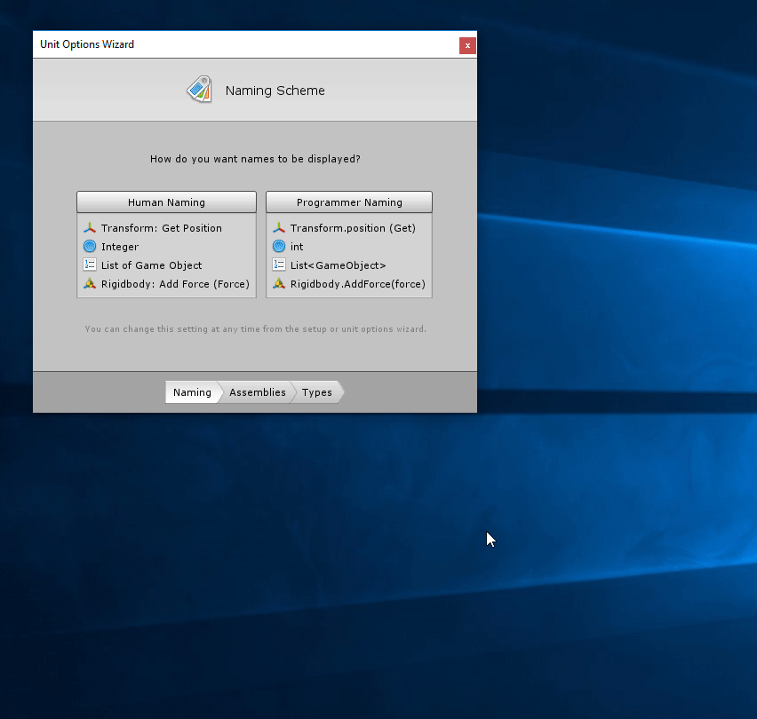

#Custom Types

| **Note**                                                     |
| :----------------------------------------------------------- |
| For versions 2019/2020 LTS, download the visual scripting solution from the [Unity Asset Store](https://assetstore.unity.com/packages/tools/visual-bolt-163802). |

Visual scripting supports every class and struct type. By default, only the most common are included in the fuzzy finder, along with all types derived from Unity objects; components, Mono behaviours, and scriptable objects.

To use a non-Unity type in your graphs, add it from **Tools** &gt; **Bolt** &gt; **Unit Options Wizard.**

For example, to use low-level graphics API calls, add the Unity Engine GL class, then click **Generate**.

To use a custom type from a custom assembly (like a third-party plugin), first add in the **Assembly Options**.
