#Predictive and Live Debugging

| **Note**                                                     |
| :----------------------------------------------------------- |
| For versions 2019/2020 LTS, download the visual scripting solution from the [Unity Asset Store](https://assetstore.unity.com/packages/tools/visual-bolt-163802). |

Visual scripting can predict and indicate units in the script that can cause an error before entering play mode. It also analyzes your graphs to anticipate missing components or null references. If an error occurs at runtime, visual scripting  pin-points the source of the euro by highlighting it in the graph.

###Predictive Debugging

When a node is not properly configured or may cause an error, it is colored yellow. When a node is certain to cause an error, it is colored orange. In both cases you should examine the node and make the required changes until it turns back to its normal color.

Example: The Log node is colored orange because it's missing the Message that it should output to the console.

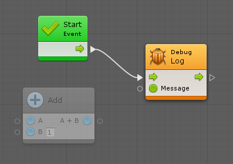

If you connect the result of A + B to Message, the Log node goes back to normal. However, the Add node  turns orange, because it's missing its first operand, A.

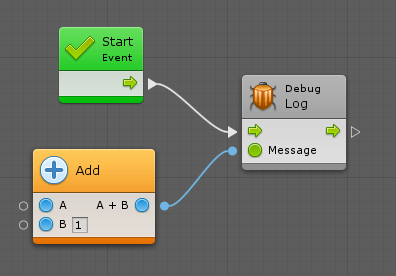

If values are provided for both operands, all colors return to normal.

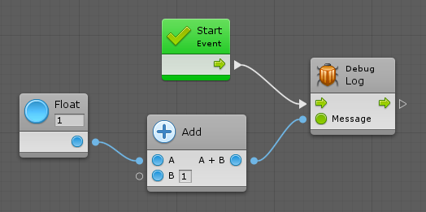

Note: The B input port does not need to be connected as it has a default inline value.

###Null References

Null reference exceptions are very common. They happen when a parameter expects a value, but it receives "nothing", or in scripting lingo, "null".

Visual scripting attempts to predict null references if the Predict Potential Null References option is checked in **Unity** > **Preferences** > **Visual Scripting** > **Flow Graph**.

Example: Even though the Destroy unit has an inline value, as it is set to "None" (null), it is colored orange.

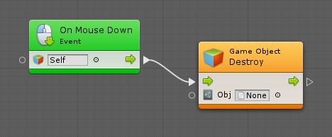

There are some rarer units that allow for null parameters. Unfortunately, because there is no way to know that from codebase analysis, visual scripting colors them orange as a false positive. If this is a recurring issue, turn off Predict Potential Null References.

###Missing Components

When units are used that require components and pass a game object or a component that does not have the specified component, the node is colored yellow as a warning. For example, even though there are default values for each value input of the Add Force unit, visual scripting detects that the owner game object does not have a rigidbody and provides a warning.

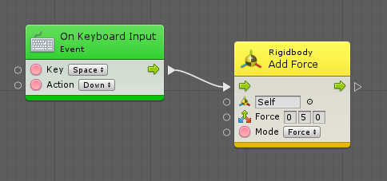

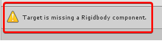

Note: Visual scripting does not color the unit orange because it is possible to add components to game objects at runtime, so the unit is not guaranteed to cause a crash if you add the required component before calling it. If this use case happens often in the project, you can disable Predict Potential Missing Components debugging from **Unity** > **Preferences** > **Visual Scripting** > **Flow Graphs**.

###Live Debugging

When in play mode, the currently active units are highlighted in blue. If an error occurs, the unit that caused it is highlighted in red.

Example: The following is an example of a faulty graph. The result logs "my 3rd third favorite fruit" to the console when you press space. 

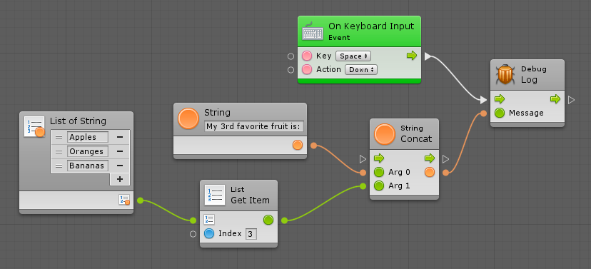

Here's what happens when play is selected and the object is clicked.

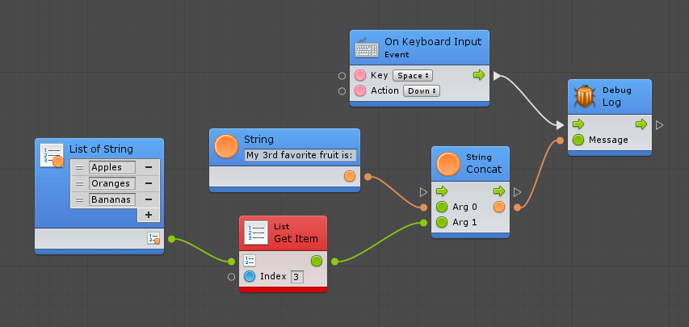

All units are highlighted in blue as soon as you click because they were activated. However, there was an error in the console.

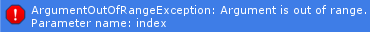

Note: Visual scripting highlights the faulty node in red.

A common mistake is to assume array indices start at 1, whereas they actually start at 0. In scripting, indices are always zero-based; the first item is at index 0, the second at index 1, the third at index 2, etc. To get third item, write 2 in the field.

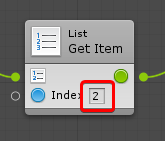

Then, the graph works as expected.

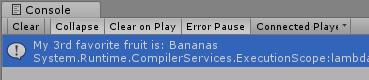
