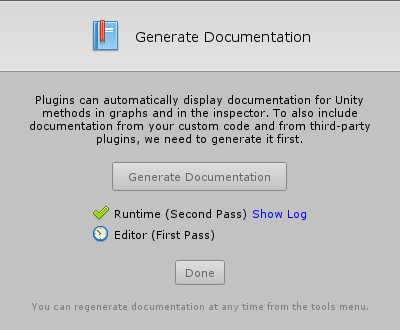

#Generating documentation

| **Note**                                                     |
| :----------------------------------------------------------- |
| For versions 2019/2020 LTS, download the visual scripting solution from the [Unity Asset Store](https://assetstore.unity.com/packages/tools/visual-bolt-163802). |

Visual scripting automatically displays Unity and .NET documentation from within the editor. It can do the same with custom scripts and third party plugins, as long as they provide [standardized XML 
documentation](https://msdn.microsoft.com/en-CA/library/b2s063f7(v=vs.100).aspx).

The setup wizard prompts you to generate this documentation. Note: you need to update your documentation if you make a change in your scripts. To do so, open Unity > Prefer **Tools** &gt; **Ludiq &gt;Generate Documentation**  and click **Generate** **Documentation**.

Generate Documentation compiles your unity projects with an enabled XML documentation switch. If your scripts do not compile at the time of generation, the documentation generation fails.

Note: Documentation generation is optional for visual scripting to run, and this step can be skipped in the setup wizard. For more details about generation failure, click **Show Log**; it is likely the system is missing [MSBuild](https://www.microsoft.com/en-us/download/details.aspx?id=48159).
