#Events unit

| **Note**                                                     |
| :----------------------------------------------------------- |
| For versions 2019/2020 LTS, download the visual scripting solution from the [Unity Asset Store](https://assetstore.unity.com/packages/tools/visual-bolt-163802). |

Scripting units listen for events. They are the starting point for all scripts and appear as special green units in graphs.

There are many kinds of events, grouped in sub-categories under the root Events category **(fuzzy finder** > **Events**):

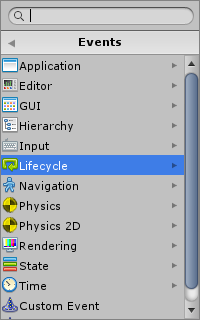

Two simple common events are Start and Update, both located under **Lifecycle**.  

*  Start is called once when the graph or event handler is first created.
*  Update is called at every frame while the graph or event handler is active.

New script machines start with both these events by default.


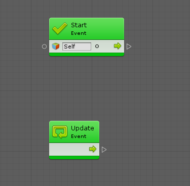

###Inputs &amp; Outputs


All events have a single Trigger control output that starts the script when they are triggered.

Value inputs are options that influence when the event is triggered. For example, some events have a Target setting that determines which object is listening to the event. Most often, you'll leave this setting at its default value of Self.

The value outputs on events are arguments that are passed from the event, giving you more information about what actually happened. For example, on the On Trigger Enter event, the other collider that is involved in the collision is an output.

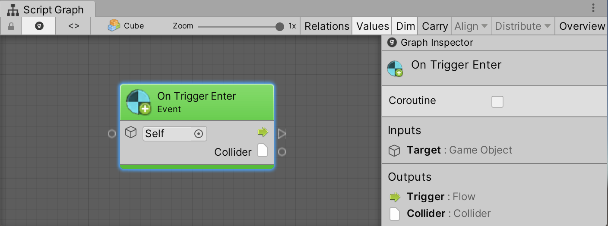

###Custom Events


There is a special type of event, the Custom Event that triggers custom events across graphs, along with their custom arguments.

For example, to create a custom event called On Damage that gets called to make the character lose health, the event should have one integer argument that indicates the amount of damage to inflict. Listen to the event by creating a Custom Event unit (under Events). Its name is set to On Damage. The field below the name is the argument count, which is set to 1.


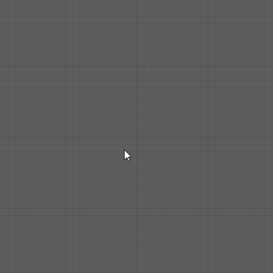

Note: Indices are zero-based, so the first argument is labeled Arg. 0.  

To trigger the event from elsewhere, use the Trigger Custom Event unit, located right under the Custom Event unit in the fuzzy finder. Enter the name of the event exactly as it is sensitive to case and whitespace.  

For example, to create a script machine on a boulder that could hit the player, use the force of the impact as the damage. 


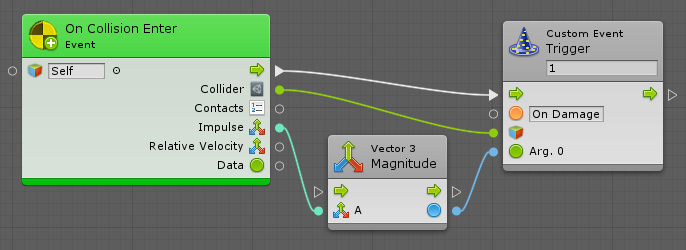

Note: The collider that hit with the boulder is the target of our trigger; the On Damage event is  triggered on all machines attached to that collider. Use the damage value to subtract health from the receiver object.


Custom events do not require a receiver and do not cause an error if there isn't a listener to handle them.

###Animation Events

Use animation events to trigger Bolt graphs when you reach a certain point in your animation. Select an object with a machine and an animator. Then, from the animation window, add an animation event.


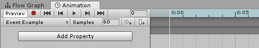

With the event selected, choose TriggerAnimationEvent as the function from the inspector.


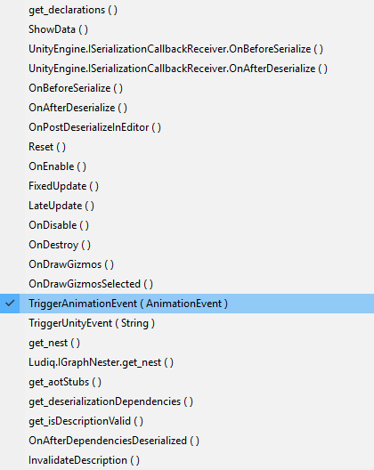

Use any parameter from the inspector.


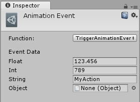

In your script graph, add an Animation Event unit (under **Events** &gt;**Animation**).  

There are two types of events: 

- a global animation event, and 
- a named animation event.


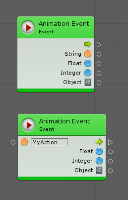

The difference is that the first type listens to all animation events on the object and return the string parameter. The second type's trigger is the string parameter that is equal to the specified name input.

###Unity Events

Use Unity Events to trigger events that have been setup from the inspector. These are commonly found in GUI components like buttons, but [they can also be created in your custom scripts](https://docs.unity3d.com/ScriptReference/Events.UnityEvent.html).


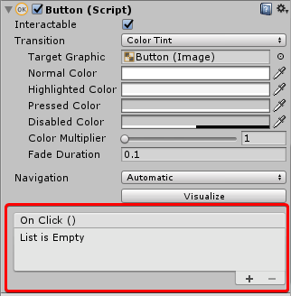

Configure them by selecting an object with a machine and select the Trigger Unity Event method. In the string field, type the event name to listen to in the graph and in the graph, add a UnityEvent unit with a matching name.


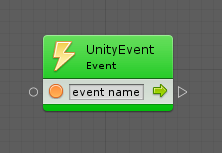

Additional arguments are not supported on Unity events.

###Events API

Visual scripting provides a simple API to trigger custom events from C# script. 

####Usings API

Add the following usings to your C# script to access the API.

```
using Ludiq;
using Bolt;
```

####Triggering API

A single method call is needed to trigger a custom event. Pass as many arguments as required.

```
CustomEvent.Trigger(targetGameObject, argument1, argument2, ...)
```

For example, this custom event unit:


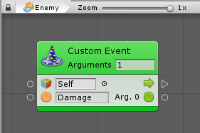


Can be triggered with this line of code.


```
CustomEvent.Trigger(enemy, "Damage", 30);
```

