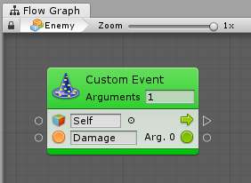

#Events API

| **Note**                                                     |
| :----------------------------------------------------------- |
| For versions 2019/2020 LTS, download the visual scripting solution from the [Unity Asset Store](https://assetstore.unity.com/packages/tools/visual-bolt-163802). |


Visual scripting provides a simple API to trigger custom events from C# script. 

###Usings

Add the following usings to your C# script to access the API.

```
using Ludiq;
using Bolt;
```

###Triggering

A single method call is needed to trigger a custom event. Pass as many arguments as required.

```
CustomEvent.Trigger(targetGameObject, argument1, argument2, ...)
```

For example, this custom event unit:





Can be triggered with this line of code.

```
CustomEvent.Trigger(enemy, "Damage", 30);
```

