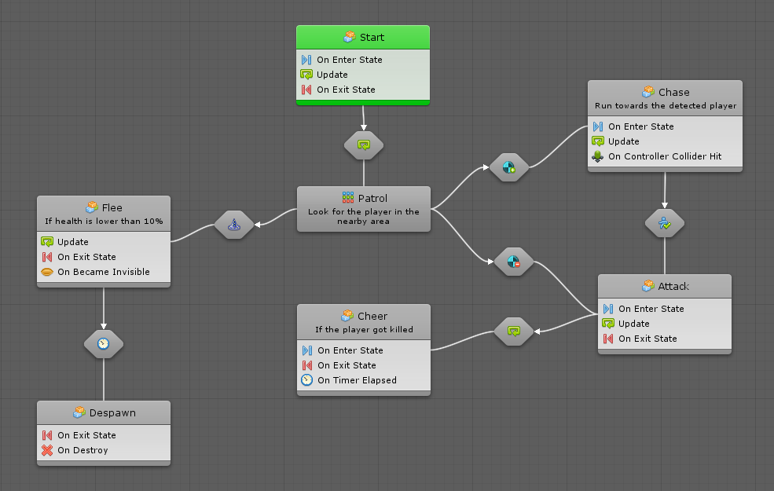
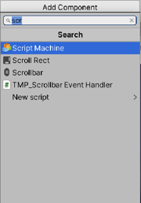
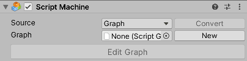

#Using graphs, states, and machines to script

| **Note**                                                     |
| :----------------------------------------------------------- |
| For versions 2019/2020 LTS, download the visual scripting solution from the [Unity Asset Store](https://assetstore.unity.com/packages/tools/visual-bolt-163802). |

Graphs are visual representations of logic. They're at the core of visual scripting.

There are two kinds of graphs:

* Script graphs connect individual actions and values in a specific order. The order of execution is the flow of the script. Script graphs are similar to Unreal Engine's Blueprints visual scripting language.

 * State graphs create different states and the transitions between them. Each state acts as a little program. State graphs are similar to PlayMaker or other FSM (Finite State Machine) systems.

With these two kinds of graphs you can create any type of game. This page explains both the graphs and their similarities. Each graph has its own full dedicated section in the manual, that is [script graphs](vs-flow.md) and [state graphs](vs-state.md) --read them in this order. As well, the two kinds of graphs can be combined: for example, each state node in a state graph is actually a script graph.

###When to use each kind of graph

* Script graphs execute actions at every frame or when an event (like a collision) occurs. Script graphs have access to all the so-called "low-level" logic, such as branching, loops, math, etc. They best answer the question "when this happens, what should I do, and in what order?".
* State Graphs are used to create "high-level" logic, like AI behaviours, scene or level structure, or anything that requires the notion of state. 
    For example, an enemy that has a "patrol", "chase" and "attack" states, or a door that has "locked", "unlocked", and "open" states. State graphs best answer the question "what is my current behaviour, and when should that change?".

The following are basic concepts that are shared by both kinds of graphs.

###Machines

A machine is a component added on a game object to execute the logic of a graph during play mode. There is one for each kind of graph: a Script Machine and a State Machine. They are located under the visual scripting category.

A script machine explains how an object is supposed to behave, while a state machine determines when an object should change its behaviour.

Both machines have the same options in the inspector. In the following example a script machine component is created.

Organize and identify the graphs by providing each with a title and summary. Neither the title nor the summary have an impact on functionality.

###Open the graph for editing

The Edit Graph button opens the graph of the machine in the graph window and the graph inspector. If you  have one machine on the same object, you won't need to use it, because visual scripting automatically matches the graph to the selection.

###Sources: Embeds versus Graphs

There are two types of sources: Embed and Graph.

| | Embed | Graph |
|---|---|---|
|Relation|The graph is embedded in the machine itself. |The graph is an asset that is referenced by the machine. |
|Re-usability|You cannot re-use the embed graph for other machines, but it is shared across prefab instances. |You can re-use the same graph for multiple machines, even if they're not on the same prefab. |
|Permanence|If you remove the machine component, the embed graph is deleted. The graph is also  deleted if you switch the Source to Graph. |If you remove the machine component, the graph asset still exists. The graph is not deleted if you switch the Source to Embed. |
|Scene Reference|The embed graph refers to game objects from the current scene in its graph, as long as it's not saved as a prefab. |The graph cannot refer to game objects from the current scene, because it does not "belong" to any scene. |
|Prefabs|The machine should not be used if you instantiate your prefab while in the editor. |The machine can safely be used on all prefabs. |

###Graphs

A graph is a re-usable set of connected units that is referenced by multiple different machines that have their Source set to Graph. A graph is generally superior to an embed - it is reusable, not tied to the object, and works safely with prefabs. However, there is a very simple guideline to determine which source to use.

To switch the Source option of a machine to graph, select the graph it should use. A Script Machine requires a Script Graph and a State Machine requires a State Graph.

 * Most often you'll use a graph. Graphs are faster to load and easier to maintain if your graph is reused across one or more objects or scene.
 * For graphs that are used once in the current scene, you can use an embed. This allows you to use scene references, which is very useful for the  GUI.

###Shared Live Update

When a graph is changed, the change applies to all objects that have that graph attached to it. There is no need to have a unique graph for every instance of an object or to copy-paste your changes.

###Converting the Source

You can convert from one kind of source to the other.

###From Graph to Embed

To  convert from Graph to Embed, click on the **Convert** button.

For example, if you were using a shared state graph for AI behaviour, but one enemy has a special behaviour, you might want to convert your graph to an embed graph to modify it independently from the others.

###From Embed to Graph

To convert from Embed to Graph, click on the **Convert** button and choose a path and file name for the new graph. Visual scripting copies all the items in your embed graph to the graph (except scene references, which are not supported in graphs). The machine then automatically switches to graph mode and references your new graph.

For example, you start working on an embed graph for movement on an enemy game object, but  want the same logic to apply to friendly NPC's. Therefore, you convert your embed graph to a graph for re-usability.
