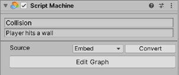

#Adding machines to prefabs

| **Note**                                                     |
| :----------------------------------------------------------- |
| For versions 2019/2020 LTS, download the visual scripting solution from the [Unity Asset Store](https://assetstore.unity.com/packages/tools/visual-bolt-163802). |

There is full prefab support for every type of graph except for embed graph prefab instances created in the editor.

| Prefab Instance| Macro| Embed|
|---|---|---|
| Created in editor|||
| Instantiated at runtime || |

If you use a machine with an embed graph as a prefab, the edits made on the prefab definition are  automatically propagated to the prefab instances. Visual scripting displays warning messages in the inspector and in the graph window when this is attempted.

Note: When adding a machine to a prefab, use a graph instead of an embed.

###Prefab Overrides

Visual scripting uses a custom serialization engine, [FullSerializer](https://github.com/jacobdufault/fullserializer), rather than Unity's default serialization. For this reason, prefabs are handled a little differently.

Note: When bolding inspector labels and values, the prefab indicates differentiation rather than override. For example, an inspector field on a prefab instance is never be bolded if it has the same value as the prefab definition, even if it has overridden this value.
