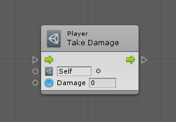
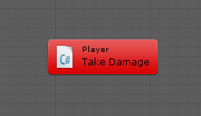

#Refactoring the script

| **Note**                                                     |
| :----------------------------------------------------------- |
| For versions 2019/2020 LTS, download the visual scripting solution from the [Unity Asset Store](https://assetstore.unity.com/packages/tools/visual-bolt-163802). |

Visual scripting automatically calls methods, fields and properties from any custom script in the project. For example, you can create a unit from a custom Player class with a TakeDamage method.

```
    using UnityEngine;

    public class Player : MonoBehaviour
    {
        public void TakeDamage(int damage)
        {
            // ...
        }
    }
```

In the script graph, if you change your script and rename or remove the TakeDamage method or the Player class, it would appear as:



The associated script would appear as:

```
    using UnityEngine;

    public class Player : MonoBehaviour
    {
        public void InflictDamage(int damage)
        {
            // ...
        }
    }
```

Finally, the unit turns red in the graph window and visual scripting logs a warning to the console.  



```
    Failed to define Bolt.InvokeMember:
    System.MissingMemberException: No matching member found: 'Player.TakeDamage'
```

###Renaming Members

To continue the previous example, to fix the failure, reopen the script file and map the new name to the previous name with the `[RenamedFrom]` attribute. It takes a single string parameter,... that is the previous name of the member.

```
    using UnityEngine;
    using Ludiq;

    public class Player : MonoBehaviour
    {
        [RenamedFrom("TakeDamage")]
        public void InflictDamage(int damage)
        {
            // ...
        }
    }
```

It is recommended to leave the attribute in your source even after a successful recompile. Visual scripting cannot guarantee Unity reserializes all the graphs with the corrected name. Visual scripting's `[RenamedFrom]` attribute works much like Unity's own [`[FormerlySerializedAs]`](https://docs.unity3d.com/ScriptReference/Serialization.FormerlySerializedAsAttribute.html) attribute in that regard.

###Renaming Types

You can rename types (including classes, structs and enums) using the `[RenamedFrom]` attribute.

For example, `Player` class is renamed to `Character`:

```
    using UnityEngine;
    using Ludiq;

    [RenamedFrom("Player")]
    public class Character : MonoBehaviour
    {
        [RenamedFrom("TakeDamage")]
        public void InflictDamage(int damage)
        {
            // ...
        }
    }
```
Note: The old name must include the namespace. In the previous example, this wasn't required as the name was in the global namespace.
