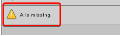

#Using relations to debug

Relations are a useful tool to understand the dependencies between each port of a unit. For example, to get the result of A + B with the Add unit, you need to provide a value for A and B. Likewise, before invoking the Log unit, you should provide a value for its Message input port.

Visual scripting uses this information in the background for Predictive Debugging. For example, if you tried to get the value of A + B without providing a value for A, the node would show up as orange to indicate that it fails in play mode.

When that happens, you can use the warnings shown in the graph inspector to know what is missing.

Relations can also help understand the ports that are required and which ports are optional. For example, in the Get Child unit (under fuzzy finder **Codebase** > **Unity Engine** > **Transform**), there is no need to connect the control ports if the goal is to get the transform value output.

Enable the Relations toggle in the toolbar for the inner connections of each unit to be displayed.

Note: You cannot edit relations. They are predefined for each type of unit.
