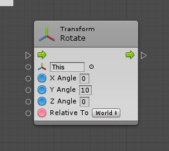
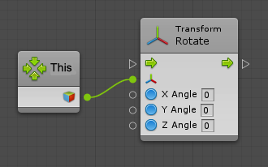
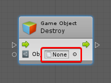
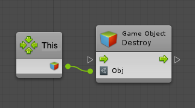

#This unit

| **Note**                                                     |
| :----------------------------------------------------------- |
| For versions 2019/2020 LTS, download the visual scripting solution from the [Unity Asset Store](https://assetstore.unity.com/packages/tools/visual-bolt-163802). |

The This unit returns the game object that owns the machine in which the graph runs.

Generally, units default their target to This, so there is no need to explicitly use the This unit. For  example, these two graphs are equivalent:

Not all units support the This inline value. Those that do not display None instead of This in their default value field; for example the Destroy unit. In these cases, manually specify the connection if you mean to use This.

Use the This unit in graphs even if they are not "yet" owned by a game object. The This unit represents the owner of the graph at runtime, when it is used in a machine.
