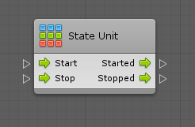

#The State Unit

| **Note**                                                     |
| :----------------------------------------------------------- |
| For versions 2019/2020 LTS, download the visual scripting solution from the [Unity Asset Store](https://assetstore.unity.com/packages/tools/visual-bolt-163802). |

**State Units** are similar to [super units](vs-super-units.md), however for state graphs rather than for script graphs; you can nest a whole state graph into a single unit in a parent script graph.

A state unit has two control input ports to indicate when to start and stop it, and two matching control output ports to specify what to do after.

When a state unit is started, all the start states in its nested state graph are entered. When it is stopped, every state and transition in its nested graph is marked as inactive.
