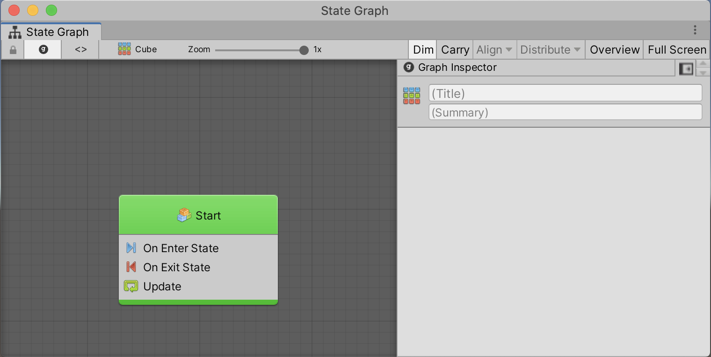
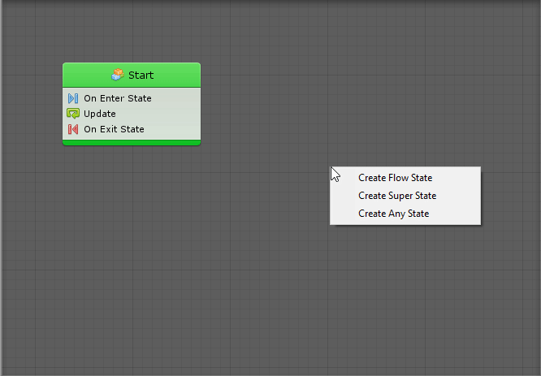

#Developing transitions using state graphs

| **Note**                                                     |
| :----------------------------------------------------------- |
| For versions 2019/2020 LTS, download the visual scripting solution from the [Unity Asset Store](https://assetstore.unity.com/packages/tools/visual-bolt-163802). |

States are self-contained behaviors that inform an object how it should behave when it's in a specific state. States are often used for artificial intelligence (AI) behaviors, scene or level structure, or any aspect of a scene that requires behaviors that transition between states.

For example, a state machine for an enemy non-player character could have four states, "Patrolling", "Chasing", "Attacking" and "Fleeing", while a state machine for a door could have three states, "Locked", "Unlocked" and "Open".

The two types of states you can add to your graphs are script states and super states. Script states contain nested script graphs. Super states contain nested state graphs. 

Note: States are connected to other states by Transitions. 

Both types of states are "nesters", meaning that they work exactly like machines: their sub-graph can either be embedded or referenced from a graph. The inspector for a super state looks and behaves in the same way.

###State machines

State graphs live in state machines. Click **Add Component** and select **State Machine** to create a state machine. Save the State Machine to edit the graph.

VS-StateMachine

###Creating states

To display the state creation menu, right-click anywhere in the empty grid of a State Graph. 

Just like units in script graphs, the new state is dimmed as it is never entered. You can disable Dim in the toolbar if you don't want the new state dimmed.

###Start State(s)

Select the state the graph begins at by selecting one or more **Start State(s)**. To do so, right-click the state and choose **Toggle Start**. Start states are highlighted in green.

Unlike most finite state machine (FSM) tools, visual scripting supports multiple start states. You can have parallel FSM's running in the same graph or joining at some point. Normally you'll only need a single start state.

###Any State

Select **Any State** to trigger transitions to other states, no matter which state is currently active. 

Note: This state cannot receive any transition or execute any action.

###Reading States

The header is the top part of a state. It displays the title and summary of its nested graph and has no impact on functionality. The header is a way to identify and comment the states. The script graph icon identifies it as a script state.  

State inspectors look and work exactly like the one for machines. Select the source for the state's nested graph then clickthe **Edit Graph** button or double-click on the state node to open its nested graph.

###Script States

The body of a script state displays a list of all the events used in its nested script graph. By default, new script states are automatically created with the On Enter State, Update and On Exit State events in the graph.

- The On Enter State is called when an incoming transition leads to the parent state. 
- The On Exit State is  called before the state is exited by one of its outgoing transitions. 
- Update is called at every frame while the state is active. 

Events added to a script graph listen only while the parent state is active.

Example: The breadcrumbs at the top left indicate that the the view is now within the state graph on a game object, inside the Start state.

Use this part of the toolbar to navigate back to parent graphs at any time. Edit the title and summary of that state at the top of the graph inspector when a node isn't selected.

Ignore the input and output port definitions. They are used for Super Units, not for Script States.  

The rest of the graph works exactly like a normal script graph. There are no restrictions on the units that can be used.

###Super States

Super states are created and edited like script states. The major difference is that their graphs are not script  graphs, but another state graph. When super states are entered, all the start states of their nested graph are entered. When super states are exited, every state and transition of the nested graph is made inactive.

###Transitions

[Transitions](vs-transitions.md) connect states to determine when the active state should switch.

###State units

[State Units](vs-state-units.md) are very similar to super units, but are used in state graphs instead of in script graphs. State units nest a state graph inside a script graph.
