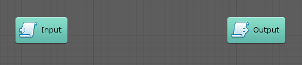
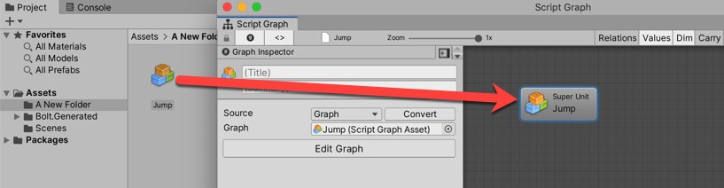

#Re-using scripts with super units

| **Note**                                                     |
| :----------------------------------------------------------- |
| For versions 2019/2020 LTS, download the visual scripting solution from the [Unity Asset Store](https://assetstore.unity.com/packages/tools/visual-bolt-163802). |

Super Units are script graphs that are nested in a parent script graph as a single unit. They are a powerful feature that provides for re-use and graph organization.

###Input Output units

By default, the embed graphs in super units are created with Input and Output units:

These units pass flow and values to and from the parent script graph.  

 *  The Input unit defines flow entry points and parameters of any type that should be passed to the super  unit from the parent graph.
 *  The Output unit defines flow exit points and results of any type that your super unit can return to the parent graph.

The following are constraints for defining inputs and outputs:

 *  The key cannot be null or empty.
 *  The key of each port must be unique across the entire graph. 
    You cannot have an input and an output with the same key, even if they are of a different kind or type.
 *  If you change a key, all connections to that port are removed. 
    Visual scripting uses keys to identify ports, so if they change, the connections become obsolete. If you want to change the name of a port without losing all the connections, you can override it with the Label property, which has no impact on functionality.
 *  Each value input and output must have a type.

The inspector warns you if you do not meet these criteria.

###Using a graph

To use a script graph as a super unit, either drag and drop the script graph from the project window into the graph or add it from the **Graphs** category in the fuzzy finder.

