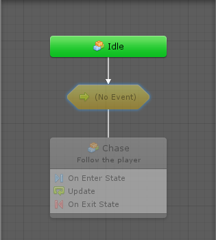
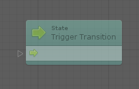
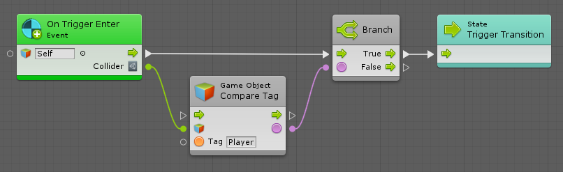
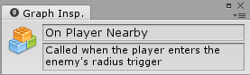
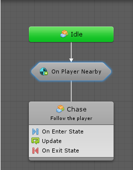
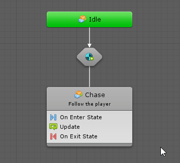
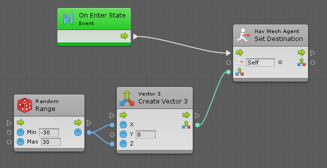
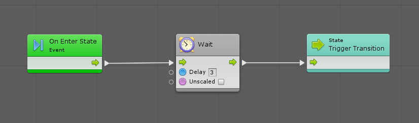
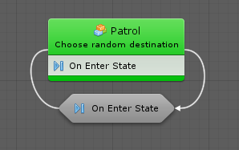
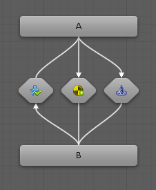

#Changing states with transitions

| **Note**                                                     |
| :----------------------------------------------------------- |
| For versions 2019/2020 LTS, download the visual scripting solution from the [Unity Asset Store](https://assetstore.unity.com/packages/tools/visual-bolt-163802). |

Transitions connect states in such a way for visual scripting to decide when the active state should switch to another state.

###Editing a Transition

Like script states, a transition is a nested script graph.

In the above example, there are several issues with the new transition. It is never traversed because the  event does not specify when to branch. Consequently, the transition along with the destination state, are both dimmed out. Double-click its unit or click the Edit Graph button, and the transition graph appears. By default, it is configured as follows:

The Trigger State Transition unit is a special unit that tells the parent state it should branch via the current transition. Use any unit in a state transition graph, such as events and branches.

For example, to transition to the chase state only when an object with the Player tag enters the trigger on the enemy, the transition graph can look like as follows:

Finally, to customize the label the transition has in the parent state graph, deselect all units and edit the graph's title in the graph inspector.

Going back to the parent state, the transition appears as:

If a custom title is not assigned for the transition, the name and description of the event is used.

By default, transition labels are always visible. If this takes up too much screen real-estate in the graph,  change the display trigger under **Unity** > **Preferences** **&gt; Visual Scripting** &gt; **State Graphs** &gt; **Transitions Reveal**.

###Self transitions for a state

It might be useful for a state to transition to itself. Right-click the state and select **Make Self Transition**.

For example, an enemy is to patrol by changing its destination to a random position every 3 seconds.

The patrol state's script graph can be:

And your self-transition's flow graph can be:

In the parent state graph, this would appear as:

###Adding multiple transitions to a state

There is no limit to the number of transitions that can be added to a state. However, there is no notion of priority between transitions. Use conditions to select the appropriate transtion.

