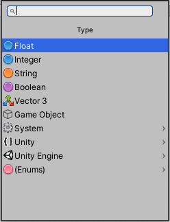

##Selecting an object type

| **Note**                                                     |
| :----------------------------------------------------------- |
| For versions 2019/2020 LTS, download the visual scripting solution from the [Unity Asset Store](https://assetstore.unity.com/packages/tools/visual-bolt-163802). |

To differentiate what [objects](vs-object-types.md) represent and what they can do, each object has a type. In visual scripting, most types are represented with an icon.

When you need to select a type, visual scripting displays a Type menu.

The most common types are available at the top of the menu. Enums are grouped at the bottom. All other types are grouped in their Namespace, which is a "folder" for types. All Unity components and types are found under the Unity Engine namespace.

###Custom Types

Visual scripting supports every class and struct type. By default, only the most common are included in the fuzzy finder, along with all types derived from Unity objects; components, Mono behaviours, and scriptable objects.

To use a custom type from a custom assembly (like a third-party plugin), first add it in the **Assembly Options**.
