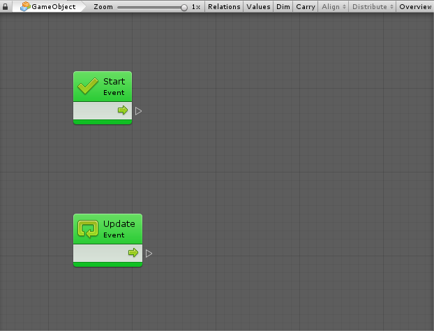

#Units

Units are the most basic element of computation in visual scripting. Units can do a wide variety of things; for example, they listen for an event, get the value of a variable, invoke methods on components and game objects.

Units use connections to indicate in what order they should be called and to pass values from one another. 

###Ports

Connections are created by hooking from the port of one unit to the port of another unit.

- On the left side of a unit are the **Input Ports**.

- On the right side of a unit are the **Output Ports**.

 * **Control Ports** are used to connect and create flow. The flow is the order in which units are executed. Flow always goes from left to right, hence the direction of the little arrow on the unit.
 * **Value Ports** are used to connect values. Each value port has a Type that must be matched when connecting nodes.

###Types of ports

**Flow Ports** indicate the order in which operations are executed. Typically, when a unit has completed processing, the flow goes to the next unit from one of the ports at the right of the current unit.

**Data Ports** contain type values. Types are either boolean, integer, string, etc. A Data Port on the right side of a unit is considered an output, while, a port on the left side of a unit is an input. Connecting them allows information to flow from one unit to to the next unit.
