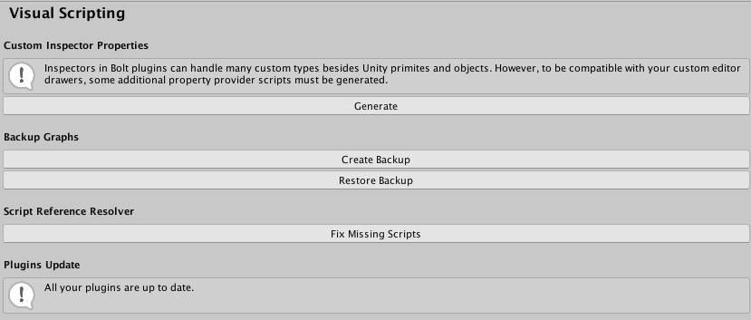

#Visual scripting update process

Unity recommends frequent backups and to store the copy of the data on a separate medium; doing so protects against primary data loss or corruption. 

Note: Always backup your data before updating visual scripting.

The update workflow for visual scripting is as follows:

1. Backup your project.
2. Open the **Package Manager** and click **Update**.

###Backup your project

The graphs and visual scripting assets backup automatically. 

It is a one-click operation to manually back-up your project.

In the menu, choose **Edit** > **Project Settings** > **Visual Scripting** > **Create Backup**, then click **OK**.

Open the backups folder via **Edit > Project Settings** > **Visual Scripting** > **Restore Backup**.

Note: It is good practice to make frequent backups if you do not use version control.

Note: Unity recommends using a version control system (VCS) such as Unity Collaborate, Git, or Subversion.

