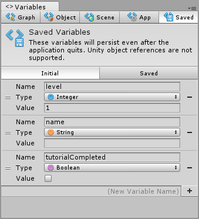
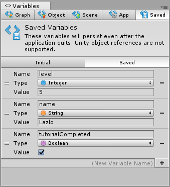
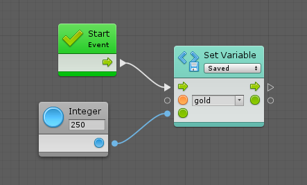

#Variables

| **Note**                                                     |
| :----------------------------------------------------------- |
| For versions 2019/2020 LTS, download the visual scripting solution from the [Unity Asset Store](https://assetstore.unity.com/packages/tools/visual-bolt-163802). |

[Variables](vs-variables-reference.md) are containers. Each variable has a name, a type, and a value. There are six types of variables in visual scripting:

|Variable type|Description|
|---|---|
|Flow Variables|Flow variables are the equivalent to local variables.|
|Graph Variables|Graph variables are local to an instance of a script graph. They have the smallest scope and cannot be accessed or modified outside their graph.|
|Object Variables|Object variables belong to a game object. They are shared across all graphs on that game object.|
|Scene Variables|Scene variables are shared across the current scene.|
|Application Variables|Application variables persist even when the scene changes. They are reset once the application quits.|
|Saved Variables|Saved variables persist even after the application quits. They can be used as a simple but powerful save system. They are saved in Unity's [player prefs](https://docs.unity3d.com/ScriptReference/PlayerPrefs.html), which means they don't refer to Unity objects like game objects and components.|

###Values in saved and initial variables

Under the Saved tab, there are two sub-tabs: Initial and Saved.

- In the initial tab, define values that are automatically created for new games.

- In the saved tab, the state of saved variables for the current computer is displayed. Edit these manually or delete them all to start over.

###Setting values in dynamic variables

Setting the value of a variable that doesn't exist automatically creates it. For example, the following graph creates a new saved integer variable named gold with a value of 250, even though it has not been previously defined.

Variables can be declared during edit mode or created during play mode.

###Variable's Visibility

All object variables in visual scripting are public and can be accessed by other objects.

