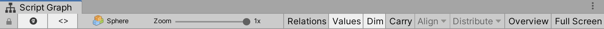
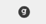
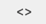
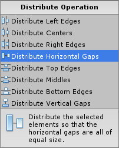

#Setting up windows and shortcuts

| **Note**                                                     |
| :----------------------------------------------------------- |
| For versions 2019/2020 LTS, download the visual scripting solution from the [Unity Asset Store](https://assetstore.unity.com/packages/tools/visual-bolt-163802). |

Set up the window layout and keyboard shortcuts to expidite common operations. This page gives an overview of setting up the windows as well as those shortcuts. You can use keyboard shortcuts to access or refine many of the visual scripting actions. There are three main windows in visual scripting are are found in **Window** > **Visual Scripting**;

 * **Graph** : The main graph editor.
 * **Graph Inspector** : The inspector for units and other graph elements.
 * **Blackboard** : A window to define and edit variables, as well as input and output ports.

Tip: Although the layout order to place the windows is a matter of preference, consider:

- giving equal space for the graph window and the scene view
- adding the graph inspector as another tab next to the Unity inspector.

###Maximizing graph window

You can maximize the graph window to occupy the whole screen. This enables sidebars for the graph inspector and variable tabs. Maximizing eases the visualization of complex graphs. There are three ways to maximize:

 * Click Shift+Space while your mouse is over the graph window.
 * Double-click the graph window background.
 * Click Maximize in the toolbar.

Use the Sidebar Layout Buttons to reorder and move each panel around the maximized viewport.

Note: If you have dual monitors, consider to locating visual scripting on your second monitor. This provides more room for graph editing and keeps the Unity layout intact. The window automatically detects if it has enough space to display the sidebars.

###The Graph Window

Once you select a graph, a toolbar displays in the graph window.

VS-GraphInspectorButton

Toggling the:

- button displays the Graph Inspector
-  button displays the Blackboard

The right side button places the Blackboard or Graph Inspector to the right side of the graph window. The left side button places the Blackboard or Graph Inspector to the left side of the graph window.

The breadcrumb path to the currently selected graph is on the left. Use the Zoom slider to zoom out and get a high-level view of the graph. 

Check the following options:

- The Relations option; units display their inner connections (script graphs only).
- The Values option; visual scripting predicts values and displays them in graph connections (script  graphs only).

When the Carry option is toggled, child units of the current selection drag with the parent unit. This is useful to reorganize a large part of the graph without manually selecting each unit.

The Overview button pans and zooms the graph to show all of its elements within the area of the window.

When two elements (or more) are selected in the graph, the Align and Distribute dropdowns become available for common automatic layout operations.

###Shortcuts and Keybindings

There are two Control Schemes that determine how to pan and zoom in the graph window. Configure the  control scheme in **Edit** > **Preferences**  > **Visual Scripting**. The default setting is Unreal.

Note: If you have a trackpad, and you want to navigate the graph with two fingers, change that setting to Unity. 

The keybindings are:

|Action | Unity Control Scheme|
|---|---|
|Pan|Middle Mouse Button |
|Zoom|Ctrl/Cmd + Scroll Wheel |
|Select|Drag Left Mouse Button|
|Select All|Ctrl/Cmd + A|
|Context Menu|Right Mouse Button   Ctrl+Click (Mac)  Ctrl/Cmd + E|
|Create Group|Ctrl/Cmd + Drag Left Mouse Button|
|Copy|Ctrl/Cmd + C|
|Paste|Ctrl/Cmd + V|
|Cut|Ctrl/Cmd + X|
|Duplicate|Ctrl/Cmd + D|
|Delete|Del|
|Maximize|Shift + Space   Double-Click|
